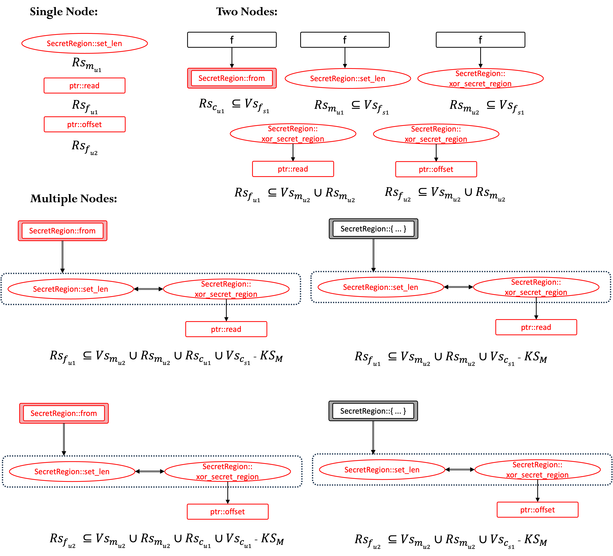
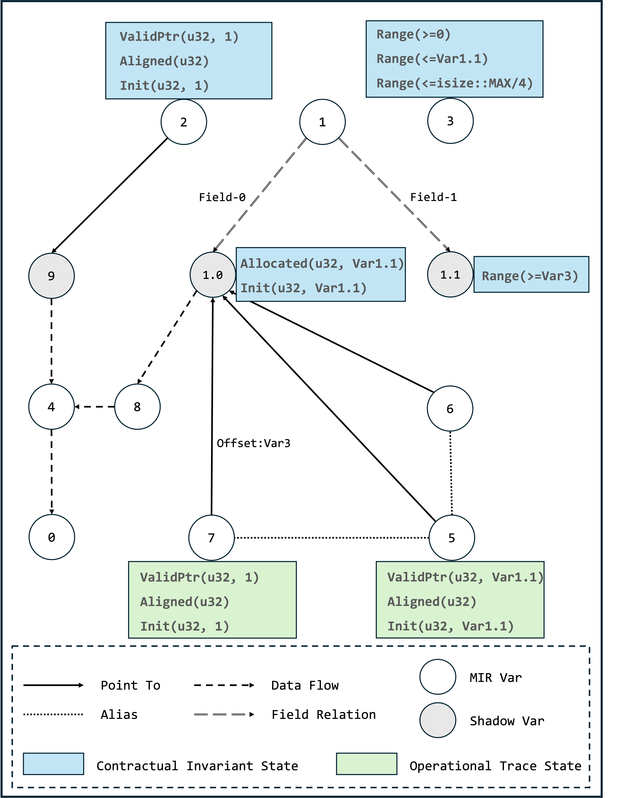

# Chapter 6.4. Unsafe Code Audit and Verification
## 1 Overview
We provide three key features related to unsafe code:

(1) Audit unit generation: Segmenting a Rust crate into multiple code units to examine the correctness of code safety declaration and safety property labeling.

(2) Safety property verification: Verifying if the safety properties required by unsafe APIs are satisfied.

(3) Safety property inference: Inferring the safety properties of unsafe APIs based on the audit unit.

### Core Assumptions
Our approach rests on two foundational assumptions:
* **P1:** All undefined behavior originates from unsafe code blocks
* **P2:** A function is sound if all execution paths satisfy safety properties of unsafe operations they interact with.

## 2 Audit Unit Generation
### 2.1 What's the Audit Unit
Audit unit is the foundational abstraction which defines analysis boundaries for verification and inference.

### 2.2 Why Audit Unit Is Needed
Just as our assumption **P1** states, undefined behavior (UB) only originates from unsafe code blocks. Therefore, the detection of UB essentially involves the management of unsafe code.

Given a Rust crate, there are three typical scenarios to be considered for unsafe code handling: 

* Original unsafe code annotation: (i) Unsafe code in a Rust crate without any other internal unsafe code; (ii) An unsafe API originating from another library outside the crate.

* Safe property delegation: An unsafe API which expose the safety requirements of internal unsafe code.

* Safety encapsulation: A safe API which fully enforces all necessary safety properties of internal unsafe code.

These scenarios inherently have boundaries, where the propagation of unsafety can be contained or observed. Therefore, to effectively isolate, analyze, and verify the safety of unsafe code, we establish audit units to enable focused and manageable safety audits.

### 2.3 How to Construct and Use Audit Unit

#### 2.3.1 Audit Unit Construction
The audit unit combines the traditional call graph with unsafe and dataflow information to capture the use and propagation of unsafe code across the project. It is constructed as follows:

(1) Identify all functions and methods with unsafe markers. Add call and object-flow edges to form unsafety propagation graph (UPG).

(2) Divide UPG according to the structural patterns of basic units (More detailed information can be obtained in [our paper](https://arxiv.org/abs/2504.21312)).

(3) Merge basic units when multiple unsafe callees share a common caller or when a dynamic-method caller has multiple constructors to construct audit units.

#### 2.3.2 Audit Unit Usage
The **audit unit** constitutes the foundational abstraction, defining analysis boundaries for verification and inference. It integrates with the [tag-std](https://github.com/Artisan-Lab/tag-std/blob/main/primitive-sp.md) - a comprehensive taxonomy of safety properties extracted from Rust's standard library - to establish a unified analytical foundation.

**Usage Summary**: Audit Unit → Set analysis scope → tag-std (safety rules) → Contracts verified or UB detected.

#### 2.3.3 Poc of Audit Unit
Here is a simple structure along with its corresponding constructor and methods.

```rust
struct St { pub ptr: *mut u8, pub len: usize }
impl St {
    pub unsafe fn from(p: *mut u8, l: usize) -> St2 {
        St2 { ptr: p, len: l }
    }
    pub unsafe fn set_len(&mut self, l:usize) {
        self.len = l;
    }
    pub fn get(&self, x: usize) -> u8 {
        if x < self.len {
            unsafe { *self.ptr.offset(x as isize) }
        } else {
            0
        }
    }
}
fn f() {
    let mut v = vec![1,2,3];
    let (p,l,_c) = v.into_raw_parts();
    let s = unsafe { St::from(p, 0)};
    unsafe { s.set_len(p, l)};
    let t = s.get(0);
}
```

Figure 1a-1c shows the specific generation process of the audit units. Here, we use **required safety property (RS)** and **verified safety property (VS)** to construct an audit formula to describe the satisfaction conditions of each audit unit. **RS** and **VS** are sets of safety tags from tag-std.


**Fig-1a**: Unsafety propagation graph. Function call `f -> St::get` are not considered in the UPG because it does not involve any safety considerations.


**Fig-1b**: Basic units generated by splitting Fig-1a. Each basic unit involves a non-trivial safety requirement that should be audited, and it cannot be further simplified.


**Fig-1c**: Audit units generated by merging Fig-1b. Each audit unit has its corresponding audit formula.

## 3 Safety Property Verification
**Senryx** is the module within RAPx responsible for verifying safety properties. Building upon the annotations from tag-std, **Senryx** employs a **tag-based verification approach** to determine whether the target code contains undefined behavior (UB). It operates as follows:

(1) **Compiler-Integrated Target Identification**: 

RAPx leverages Rust's compiler callback to identify MIR instances and filter unsafe code segments as target set. Then pass the set on to **Senryx**.

(2) **Stateful Field Analysis**

**Senryx** performs data-flow and state tracking on MIR bodies. If target is a method, then its constructors and other mutable methods will be evaluated for field modification patterns.

* **Fragile Fields**: The public fields within a structure are considered fragile because they can be accessed and modified from outside constructors. We are still exploring and evaluating the impact of fragile fields on safety properties.

* **Modified Fields**: Modified fields will generate the method sequence, which is used to determine all possible pre-target states. This analysis is necessary because it accounts for side effects. For example, `St2::set_len` will make `St2::get` get into a hazard state in Section 2.

(3) **Control-Flow Modeling**

`Body visitor` employs MOP to capture state transitions and construct dominated graphs (see Section 3.2 for more details).

(4) **Contract-Based Safety Verification**

Contract verifier will be applied to check whether all the safety properties of the unsafe callees are fully satisfied (see Section 3.1 for more details).


### 3.1 Contract Construction
**Senryx** utilizes the property annotations for the Rust std-lib provided by tag-std, constructing a framework of specifications recognizable by RAPx. For example:
```rust
#[rapx::inner(property = Align (data, T), kind = "precond")]
#[rapx::inner(property = NonNull (data, T), kind = "precond")]
#[rapx::inner(property = ValidPtr (data, T, len), kind = "precond")]
#[rapx::inner(property = Init (data, T, len), kind = "precond")]
#[rapx::inner(property = InBound (data, T, len), kind = "precond")]
#[rapx::inner(property = Alive (ret), kind = "hazard")]
#[rapx::inner(property = Alias (data), kind = "hazard")]
pub const unsafe fn from_raw_parts<'a, T>(data: *const T, len: usize) -> &'a [T] {
    ...
}
```
We need to fork the Rust standard library to apply the above-mentioned annotation format to all the unsafe APIs. Subsequently, use the following command to build the target crate that we wish to analyze:
```
cd /to-be-verified-crate/

export RUSTUP_TOOLCHAIN=nightly-2025-06-02
export __CARGO_TESTS_ONLY_SRC_ROOT=/path-to-pre-annotated-std-lib/library

// In Linux
cargo +nightly-2025-06-02 rapx -verify -- -Zbuild-std=panic_abort,core,std --target x86_64-unknown-linux-gnu
// In Mac(Arm)
cargo +nightly-2025-06-02 rapx -verify -- -Zbuild-std=panic_abort,core,std --target aarch64-apple-darwin
```
This command will load all the contracts that have been pre-annotated. For example, if target crate uses `slice::from_raw_parts`, then the static analyzer will check the contracts of it based on the program state.

### 3.2 Program State
**Senryx** analyzes the current crate at the **MIR** level. For each variable in the MIR, it maintains the necessary program states as dictated by the contracts. All state information is recorded within a data structure termed the Dominated Graph (DG).

As shown below, DG employs two forms to record the state of variables: 

(i) All annotations preceding the unsafe code will construct the **Contractual Invariant States (CIS)** of the arguments; 

(ii) The static analyzer analyzes step by step along the MIR path and infers the **Operational Trace States (OTS)** based on the semantics. 

When reaching the point where unsafe code is called, it will check whether the arguments can pass through the contracts by their states.

#### Poc of Dominated Graph
For example, the function `xor_secret_region` is the target that we need to verify whether it can cause UB. Then we follow the tag-std format to label it.
```rust
/// Record secret buffer with its size.
struct SecretRegion {
	buffer: Vec<u32>,
    size: usize,
}

// ValidPtr (ptr, u32, 1)
// Aligned (ptr, u32)
// Init (ptr, u32, 1)
// ValidNum (offset >= 0)
// ValidNum (region.size >= offset)
// ValidNum (offset * 4 <= isize::MAX)
// Allocated (region.buffer, u32, region.size)
// Init (region.buffer, u32, region.size)
pub unsafe fn xor_secret_region(
    ptr: *mut u32,
    offset: isize,
    region: SecretRegion
) -> u32 {
    let mut src_value = ptr.read();
    let secret_ptr = region.buffer.as_ptr();
    let secret_region = secret_ptr.offset(offset);
    let secret_value = secret_region.read();
    src_value ^= secret_value;
    src_value
}

```

This function uses two std unsafe APIs:`ptr::read` and `ptr::offset`. What we need to do is to verify whether the contracts below have been fulfilled in the program:

```
Contracts of ptr::read
// ValidPtr (ptr, u32)
// Aligned (ptr, u32)
// Init (ptr, u32, 1)

Contracts of ptr::offset
// InBounded (ptr, u32, count)
// ValidNum (count * size_of(T) <= isize::MAX)

```

Subsequently, **Senryx** will perform state assignment for the variables based on abstract interpretation using the annotations and function MIR:


The figure below is **dominated graph** for this MIR. 

When initialized, it will check and record the **CIS** for each argument. It is worth noting that DG will create shadow variables for each variable's fields and the memory they point to to preserve more granular state, such as **Var9 - Var11**.


***Contract checking process of Senryx** (Illustrated by the case of `ptr::offset`):

(1) **InBounded (ptr, u32, count)**

* Since the original memory (**Var10**) has the `Allocated` and `Init` states, the generated alias pointer **Var5** also inherits this state and has the `ValidPtr` semantic.

* When reaching the call point of `ptr::offset`, since the `ValidPtr(ptr, u32, var11)` of **Var5** contains the OTS `InBound(ptr, u32, var11)`, and the CIS of **Var2** satisfies `Range(<=Var11)`, this contract has been passed.

(2) **ValidNum (count * size_of(T) <= isize::MAX)**

* **Var2** has the CIS `Range(<=isize::MAX/4)`, combined with the type of element is `u32`, so it can ensure the total length does not exceed `isize::MAX`.

### 3.3 Hazard Path Analysis
Before reaching the unsafe call site, we need to track the variable states of its arguments. They may be affected by other variables along the path. We refer to such paths as **hazard paths**.

If the analysis target is a method taking `self` as an argument, its hazard paths comprise two components:
* Inter-procedural paths combining constructors and mutable methods. This can be referred to in the **_Adt analyzer_** section of the above architecture diagram. The algorithm for generating mutable method sequence is still under development.
* Intra-procedural paths from the function's entry point(s) to unsafe call sites within the method body.

If the analysis target is a function without a `self` parameter, only the latter is considered.


## 4 Safety Property Inference
### 4.1 audit unsafe APIs' SP in `core` and `alloc`
Specifically, we currently integrate a set of SP labels analysis for `core` and `alloc` crate of the Rust standard library.
1. Create a new `helloworld` project.
2. Navigate to the `helloworld` project directory and run:
```
cargo rapx -stdsp -- -Z build-std --target x86_64-unknown-linux-gnu > /your/output/log/path/result.log 2>&1
```
Replace /your/output/log/path with your desired output directory. This will output APIs where the caller and callee have different SPs.

